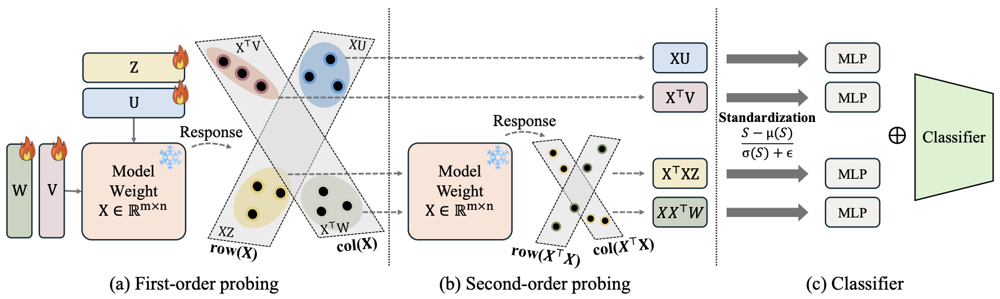

# MVProbe

<p align="center">
  
</p>

Official PyTorch implementation of **"What Linear Probes Miss: Multi-View Probing for Weight-Space Learning"** (ICML 2026).

[](https://AI-hew-math.github.io/MVProbe/) &nbsp;
[](https://arxiv.org/abs/2605.23410) &nbsp;
[](https://openreview.net/forum?id=vfqrmuVULL)

> **Note on collaboration.** This codebase was developed jointly with the co-authors of the paper. It is not the work of a single author — please see the paper for the full author list and contributions.

## Main Results

### Discriminative (Accuracy %, mean<sub>±std</sub> over seeds 1–5)

| Method | ResNet | SupViT | MAE | DINO |
|--------|--------|--------|-----|------|
| StatNN | 55.20 | 55.80 | 54.83 | 55.69 |
| ProbeGen | 78.27 | 78.48 | 70.68 | 61.26 |
| ProbeX | 81.61<sub>±1.29</sub> | 88.08<sub>±0.39</sub> | 77.11<sub>±0.14</sub> | 72.54<sub>±0.18</sub> |
| ProbeX (x4) | 87.16<sub>±0.26</sub> | 90.33<sub>±0.31</sub> | 77.26<sub>±0.12</sub> | 73.25<sub>±0.21</sub> |
| **MVProbe (Ours)** | **92.24**<sub>±0.25</sub> | **92.33**<sub>±0.37</sub> | **81.62**<sub>±0.15</sub> | **78.29**<sub>±0.31</sub> |

### Generative: Stable Diffusion LoRA (mean<sub>±std</sub> over seeds 1–5)

**SD_200** (200 ImageNet classes, layer 46)

| Method | In-Distribution Acc | Zero-shot Acc |
|--------|---------------------|---------------|
| ProbeX | 98.48<sub>±0.48</sub> | 94.01<sub>±0.77</sub> |
| ProbeX (x4) | 97.72<sub>±0.50</sub> | 93.53<sub>±1.99</sub> |
| **MVProbe (Ours)** | **99.80**<sub>±0.00</sub> | **95.53**<sub>±0.65</sub> |

**SD_1k** (1000 ImageNet classes, layer 46)

| Method | In-Distribution Acc | Zero-shot Acc |
|--------|---------------------|---------------|
| ProbeX | 35.75<sub>±2.44</sub> | 52.42<sub>±2.48</sub> |
| ProbeX (x4) | 32.46<sub>±3.08</sub> | 51.14<sub>±3.88</sub> |
| **MVProbe (Ours)** | **97.88**<sub>±0.37</sub> | **97.96**<sub>±0.29</sub> |

## Installation

```bash
git clone https://github.com/AI-hew-math/MVProbe.git
cd MVProbe
pip install -r requirements.txt
```

**Requirements:** Python >= 3.10, PyTorch >= 2.0, CUDA GPU

## Dataset

We use the [Model Jungle dataset](https://huggingface.co/ProbeX) for discriminative experiments (ResNet101, SupViT, MAE, DINO fine-tuned on 50 CIFAR-100 classes) and the SD_200/SD_1k datasets for generative experiments (LoRA weights from Stable Diffusion).

## Reproducing Results

We provide Slurm scripts in `scripts/` for all experiments. Set `DATA_ROOT` in each script before running.

### 1. Discriminative

Best layers per model:

| Model | Layer | `--is_resnet` |
|-------|-------|---------------|
| ResNet | 67 | True |
| SupViT | 59 | False |
| MAE | 64 | False |
| DINO | 47 | False |

**Single run (best layer, 4 models):**

```bash
sbatch scripts/run_discriminative_best_layer.sh
```

**Seed average (seeds 1-5, 4 models):**

```bash
sbatch scripts/run_discriminative_seed_avg.sh
```

**All layers (per-model layer sweep):**

```bash
# Edit MODEL, N_LAYERS, IS_RESNET in the script, then:
sbatch scripts/run_discriminative_all_layers.sh
```

### 2. Generative (LoRA)

**Single run (SD_200 + SD_1k, layer 46):**

```bash
sbatch scripts/run_generative.sh
```

**Seed average (seeds 1-5):**

```bash
sbatch scripts/run_generative_seed_avg.sh
```

### 3. Ablation Study

Branch subset analysis on a single model:

```bash
sbatch scripts/run_ablation.sh
```

Ablation options: `xu`, `xtu`, `xxtu`, `xtxu`, `first_order` (xu+xtu), `second_order` (xxtu+xtxu), `none` (all branches).

### 4. Downstream Evaluation

OCC, kNN classification, and retrieval on generative model representations:

```bash
sbatch scripts/run_downstream.sh
```

## Acknowledgements

This codebase is built upon [ProbeX](https://github.com/eliahuhorwitz/ProbeX) [[1]](#references).

## References

[1] Horwitz et al., "Learning on Model Weights using Tree Experts," CVPR 2025. [Paper](https://arxiv.org/abs/2410.13569) | [Code](https://github.com/eliahuhorwitz/ProbeX)
